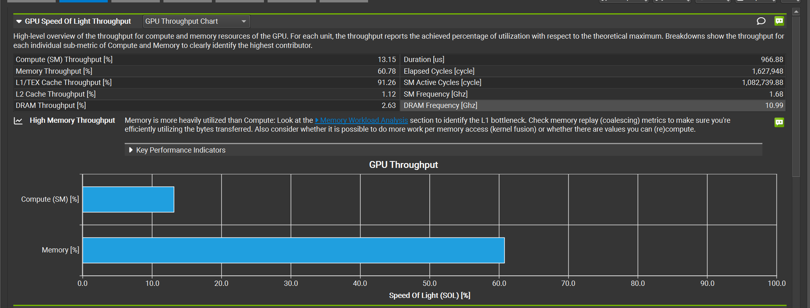

# FUSED W4A16 GEMV 算子优化
# 提高带宽利用率  
在前面提交的那一份，已经实现了基础功能，可以准确计算结果了。接下来根据题目的要求，还得提高带宽利用率。  
要提高利用率，先看看哪些地方可以被提高的。  
查了一下，有下面这几个分析工具。第一个是CUDA Events，他测量GPU流中这一段执行用了多久；第二个是Nsight Compute，他来测量单个kernel使用了哪些硬件资源，哪里在等待；第三个是Nsight System，他测量CPU和GPU的时间线上，哪里有启动开销，空闲，或者等待  
**有效带宽利用率**是逻辑有效数据量除以kernel耗时*GPU峰值带宽。那么数据肯定是不变的，GPU的峰值带宽也是固定的。也就是，我们**能优化的只有时间了**  
耗时有这几个影响因素。一个是**实际搬运量**，也就是，我们可以去看看，**同样的计算，有没有产生重复读取或者浪费的访存事务**；第二个是**搬运的并行程度**，**就是能不能有持续的访存请求，让显存系统充分工作**；第三个是**处理数据的开销**，比如**解包，类型转换，乘加**这些  
其实我们能优化的也只有gemv_w4a16.cu这个文件了，因为其他几个都是基本固定了的。  

我们来使用ncu工具来测试一下现在的有效带宽和利用率。因为之前AI写的测试脚本中，前4个都是小尺寸用例，第五个才是题目的正式形状。所以需要skip前四个，测试第五个。另外我们还需要指定名字为gemv_kernel的算子。此外一开始报错了，所以加上第一句，允许跟踪子进程    
```
ncu \
  --target-processes all \
  --kernel-name regex:gemv_kernel \
  --launch-skip 4 \
  --launch-count 1 \
  --set basic \
  python test_local.py
```

运行，不知道为什么显示ERR_NVGPUCTRPERM  
说是ncu没有权限读GPU的性能计数器  
这里太折腾了，我还是用自己的电脑试一下吧。发现还有这个问题，于是查了一下，发现需要从“系统 → 高级 → 开发者 → 管理 GPU 性能计数器 → 允许所有用户访问”这里开启，然后就好了。  
很好，现在得到了这样的分析结果  
```
[14435] python3.10@127.0.0.1
  gemv_kernel(const __half *, const unsigned char *, const __half *, const__half *, __half *, int, int, int) (32, 1, 1)x(128, 1, 1), Context 1, Stream 7, Device 0, CC 12.0
    Section: GPU Speed Of Light Throughput
    ----------------------- ----------- ------------
    Metric Name             Metric Unit Metric Value
    ----------------------- ----------- ------------
    DRAM Frequency                  Ghz        10.99
    SM Frequency                    Ghz         1.69
    Elapsed Cycles                cycle      1621955
    Memory Throughput                 %        60.92
    DRAM Throughput                   %         2.64
    Duration                         us       962.50
    L1/TEX Cache Throughput           %        91.13
    L2 Cache Throughput               %         1.11
    SM Active Cycles              cycle   1084265.23
    Compute (SM) Throughput           %        13.18
    ----------------------- ----------- ------------

    OPT   Memory is more heavily utilized than Compute: Look at the MemoryWorkload Analysis section to identify the L1 
          bottleneck. Check memory replay (coalescing) metrics to make sure you're efficiently utilizing the bytes      
          transferred. Also consider whether it is possible to do more work per memory access (kernel fusion) or        
          whether there are values you can (re)compute.                                             

    Section: Launch Statistics
    -------------------------------- --------------- ---------------
    Metric Name                          Metric Unit    Metric Value
    -------------------------------- --------------- ---------------
    Block Size                                                   128
    Cluster Scheduling Policy                           PolicySpread
    Cluster Size                                                   0
    Function Cache Configuration                     CachePreferNone
    Grid Size                                                     32
    Preferred Cluster Size                                         0
    Registers Per Thread             register/thread              40
    Shared Memory Configuration Size           Kbyte           32.77
    Driver Shared Memory Per Block       Kbyte/block            1.02
    Dynamic Shared Memory Per Block       byte/block               0
    Static Shared Memory Per Block        byte/block               0
    # SMs                                         SM              26
    Stack Size                                                  1024
    Threads                                   thread            4096
    # TPCs                                                        13
    Enabled TPC IDs                                              all
    Uses Green Context                                             0
    Waves Per SM                                                0.10
    -------------------------------- --------------- ---------------

    OPT   If you execute __syncthreads() to synchronize the threads of a block, it is recommended to have at least two  
          blocks per multiprocessor (compared to the currently executed 1.2 blocks) This way, blocks that aren't        
          waiting for __syncthreads() can keep the hardware busy.                                             

    Section: Occupancy
    ------------------------------- ----------- ------------
    Metric Name                     Metric Unit Metric Value
    ------------------------------- ----------- ------------
    Max Active Clusters                 cluster            0
    Max Cluster Size                      block            8
    Overall GPU Occupancy                     %            0
    Cluster Occupancy                         %            0
    Block Limit Barriers                  block           24
    Block Limit SM                        block           24
    Block Limit Registers                 block           12
    Block Limit Shared Mem                block           32
    Block Limit Warps                     block           12
    Theoretical Active Warps per SM        warp           48
    Theoretical Occupancy                     %          100
    Achieved Occupancy                        %        11.18
    Achieved Active Warps Per SM           warp         5.37
    ------------------------------- ----------- ------------

    OPT   Est. Local Speedup: 88.82%                                             
          The difference between calculated theoretical (100.0%) and measured achieved occupancy (11.2%) can be the     
          result of warp scheduling overheads or workload imbalances during the kernel execution. Load imbalances can   
          occur between warps within a block as well as across blocks of the same kernel. See the CUDA Best Practices   
          Guide (https://docs.nvidia.com/cuda/cuda-c-best-practices-guide/index.html#occupancy) for more details on     
          optimizing occupancy.                                             

    Section: GPU and Memory Workload Distribution
    -------------------------- ----------- ------------
    Metric Name                Metric Unit Metric Value
    -------------------------- ----------- ------------
    Average DRAM Active Cycles       cycle       279032
    Total DRAM Elapsed Cycles        cycle     42311680
    Average L1 Active Cycles         cycle   1084265.23
    Total L1 Elapsed Cycles          cycle     42167630
    Average L2 Active Cycles         cycle    849579.12
    Total L2 Elapsed Cycles          cycle     25290560
    Average SM Active Cycles         cycle   1084265.23
    Total SM Elapsed Cycles          cycle     42167630
    Average SMSP Active Cycles       cycle   1082780.62
    Total SMSP Elapsed Cycles        cycle    168670520
    -------------------------- ----------- ------------

    OPT   Est. Speedup: 22.08%                                             
          One or more SMs have a much higher number of active cycles than the average number of active cycles. Maximum  
          instance value is 33.03% above the average, while the minimum instance value is 15.39% below the average.     
    ----- --------------------------------------------------------------------------------------------------------------
    OPT   Est. Speedup: 22.11%                                             
          One or more SMSPs have a much higher number of active cycles than the average number of active cycles.        
          Maximum instance value is 33.12% above the average, while the minimum instance value is 15.31% below the      
          average.                                             
    ----- --------------------------------------------------------------------------------------------------------------
    OPT   Est. Speedup: 22.08%                                             
          One or more L1 Slices have a much higher number of active cyclesthan the average number of active cycles.    
          Maximum instance value is 33.03% above the average, while the minimum instance value is 15.39% below the      
          average.                                             
```
我其实使用NVIDIA Nsight Compute看的，有图形界面  
  
看到这里的Duration是966.99us，计算下来，有效带宽大概是9.24GB/s，但是我查了一下，RTX5060 Laptop的峰值显存带宽能达到384GB/s，也就是我的利用率只有2.4%哈哈哈  
先看看有哪些地方可以提升的，我们现在看GPU有没有足够的并行工作。这部分就看block的数量，thread的数量和实际驻留的warp数量。这几个指标在报告中都可以看到。比如启动了多少个block，这是grid size，这里看到我的grid size是32；然后看block size，也就是每个block有多少个线程，我这里是128，感觉偏少了；然后是驻留的warp，这个要看Achieved Occupancy，他的意思是运行时实际平均驻留的warp占硬件上限的比例，我这里只有11.19%。  
我一开始以为的是，每个block的线程数不够多有影响，不过查询了一下发现我理解不对。因为原来的thread是128，有32个block。现在thread有256，block就只要16个；**然而一个block只能交给一个SM执行，而我的GPU有26个SM，32个block能让全部的SM分到任务，如果变成16个，反而有一些SM会空闲**。SM是流式多处理器，GPU把block分配给SM，SM再以warp为单位执行其中的线程。  
看来需要换一个思路了。我们要提升实际的warp驻留率，就需要给GPU提供更多可以同时执行的warp